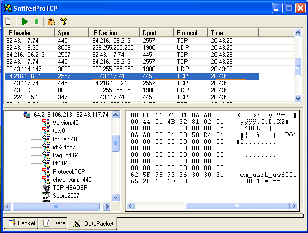



## SniffProTCP

### Description

The it is a program that brings the traffic, so much for protocols tcp, udp, icmp.ummmmm look at it
 
### More Info
 

             |
---                |---
**Submitted On**   |2004-07-04 14:48:14
**By**             |[Manuel\(ErcUn\)](https://github.com/Planet-Source-Code/PSCIndex/blob/master/ByAuthor/manuel-ercun.md)
**Level**          |Intermediate
**User Rating**    |4.3 (13 globes from 3 users)
**Compatibility**  |VB 5\.0, VB 6\.0
**Category**       |[Complete Applications](https://github.com/Planet-Source-Code/PSCIndex/blob/master/ByCategory/complete-applications__1-27.md)
**World**          |[Visual Basic](https://github.com/Planet-Source-Code/PSCIndex/blob/master/ByWorld/visual-basic.md)
**Archive File**   |[SniffProTC176585742004\.zip](https://github.com/Planet-Source-Code/manuel-ercun-sniffprotcp__1-54757/archive/master.zip)

